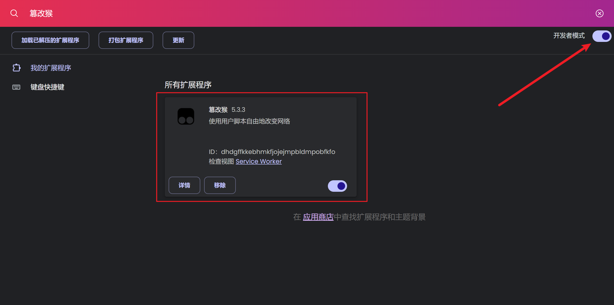

# TamperMonkey Scripts

## Install TamperMonkey Extension & Enable Develepment Mode

## Add js script in TemperMonkey

## References

-   [Tampermonkey 文档](https://www.tampermonkey.net/faq.php)
-   [篡改猴 Tampermonkey 的使用](https://juejin.cn/post/7400580315181219851)
