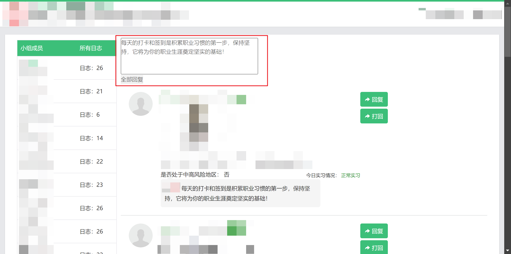

# 为云就业平台的实习日志添加全部回复功能

## Scripts

```javascript
// ==UserScript==
// @name         bibibi-reply-all
// @namespace    http://tampermonkey.net/
// @version      2025-01-06
// @description  Add reply all on 云就业实习日志: http://platform.bibibi.net/practice/diary!
// @author       SanyEdu
// @match        http://platform.bibibi.net/practice/diary*
// @icon         https://www.google.com/s2/favicons?sz=64&domain=bibibi.net
// @grant        none
// ==/UserScript==

function createReplyAllForm(diaryList) {
    var form_div = document.createElement("div");
    var form = document.createElement("form");
    form.id = "dynamicForm";

    // 创建 textarea 元素
    var textarea = document.createElement("textarea");
    textarea.id = "replyAllTextarea";
    textarea.rows = 4;
    textarea.cols = 50;
    textarea.value =
        "每天的打卡和签到是积累职业习惯的第一步，保持坚持，它将为你的职业生涯奠定坚实的基础！";

    // 创建按钮元素
    var button = document.createElement("button");
    button.type = "button";
    button.id = "myButton";
    button.textContent = "全部回复";

    // 将 textarea 和 button 添加到 form 中
    form.appendChild(textarea);
    form.appendChild(document.createElement("br"));
    form.appendChild(button);

    // 将表单添加到页面的 body 中
    diaryList.insertBefore(form_div, diaryList.firstChild);
    form_div.appendChild(form);
    return button;
}

window.addEventListener("load", function () {
    "use strict";

    // 获取 id 为 diaryList 的 div 元素
    var diaryList = document.getElementById("diaryList");

    // 获取 diaryList 下所有 class 为 item clearfix 的 div 元素
    var items = diaryList.getElementsByClassName("item clearfix");

    var btn_reply_all = createReplyAllForm(diaryList);
    // 绑定 button 的点击事件
    btn_reply_all.addEventListener("click", function () {
        var content = document.getElementById("replyAllTextarea").value;
        console.log("全部回复的内容是: ", content);

        // 遍历所有符合条件的 div 元素
        for (var i = 0; i < items.length; i++) {
            // 点击回复
            var item = items[i];
            var btn = item.getElementsByClassName("btn-add")[0];
            btn.click();

            // 设置回复内容
            document.getElementById("reply_content").value = content;

            // 点击提交
            var div_dlg = document.getElementsByClassName(
                "ui-popup ui-popup-modal ui-popup-show ui-popup-focus"
            )[0];
            var footer = div_dlg.getElementsByClassName("ui-dialog-button")[0];
            var confirm_btn = footer.children[1];
            confirm_btn.click();
        }
    });
});
```

## Screenshots


